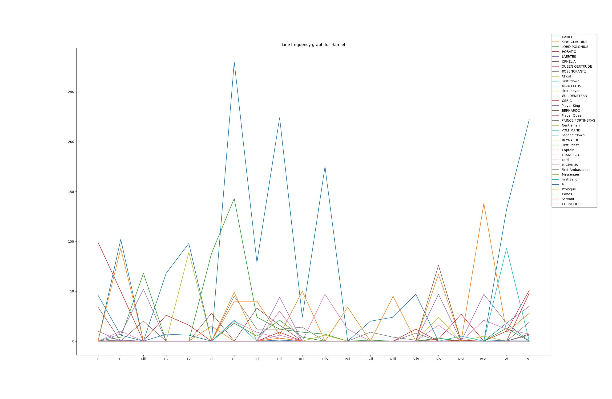

# Shakespearean Stats
Simple Python script to analyze and parse Shakespeare plays and extract some statistics in useful formats.
## Usage
`python3 shakespeare.py [-g Graph lines over scenes] [-s Save lines over scenes as a CSV file] [-p Print stats to terminal]`

When you run the program you can select from the list of known Shakespeare plays, and use the command line arguments to export statistics in the format you desire.

Example of a line frequency graph:

Character names might be inconsistent with their descriptions in the DRAMATIS PERSONAE and if the name of the character changes throughout the play the program will parse it as two seperate characters.

Feel free to add an issue or pull request for ideas to parse further statistics! There is lots of linguistic analysis and more useful graphs that could be added to this project, but the simple script fits my current needs. Hope this can be helpful to someone!